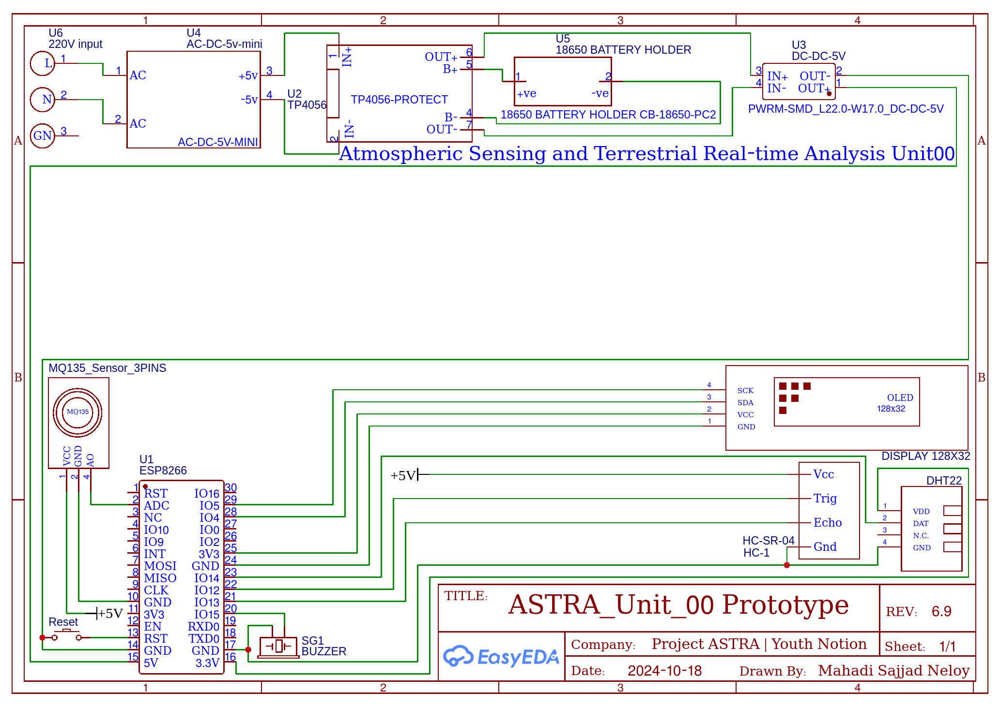

# Atmospheric Sensing and Terrestrial Real-time Analysis Unit00 Documentation

This documentation explains how to replicate the system step by step.

## Prerequisites

1. **Common Sense**: Essential for understanding and following these instructions.


2. **Basic Programming Knowledge**: Familiarity with C or C++ is required to understand the code and make modifications if necessary.  


## Hardware Connections


### Components Required

- **ESP8266 (NodeMCU)**: Microcontroller for processing.
- **DHT22 Sensor**: Measures temperature and humidity.
- **HC-SR04 Ultrasonic Sensor**: Detects displacement.
- **SSD1306 OLED Display (128x32, I2C)**: Displays debug data.
- **TP4056 BMS and battery Module**: Should be fucking obvious.
- **5V Power Supply**: 220V AC to 5C DC.

### Wiring Diagram
| Component             | ESP8266 Pin  |
|-----------------------|--------------|
| DHT22 Data            | D5           |
| HC-SR04 Trig          | D6           |
| HC-SR04 Echo          | D7           |
| OLED Display SDA      | D2           |
| OLED Display SCL      | D1           |
| MQ135 Analog Sensor   | A0           |


#### Notes
- For the **DHT22**, use a 10kΩ pull-up resistor between the data pin and 3.3V.  
- The **OLED** I2C address is `0x3C`. Ensure your display matches this configuration.


## Software Setup

This project uses **PlatformIO** as the development environment. Follow these steps to set it up:

### Install PlatformIO
1. Install [Visual Studio Code](https://code.visualstudio.com/).
2. Install the [PlatformIO](https://platformio.org/) extension via the Extensions Marketplace.

### Configure PlatformIO
1. Clone and open the project in PlatformIO:
   - Use Github desktop and clone the repo from the remote to local.
   - Or run this command and clone the repository directly
   ```bash
   git clone https://github.com/youthnotion/ASTRA_Unit_00.git
   ```
2. Add your user to the `dialout` group to allow serial communication with the MCU:
   ```bash
   sudo usermod -a -G dialout user
   ```
   Take care to replace the word `user` with your username.
3. Create a `UplinkTargetingModule.h` file to store your WiFi and [Blynk](https://docs.blynk.io/en) credentials or simply rename `UplinkTargetingModule.txt ` located in the `include` folder:
   ```cpp
   #define BLYNK_TEMPLATE_ID ""
   #define BLYNK_TEMPLATE_NAME ""
   #define BLYNK_AUTH_TOKEN ""
   
   char ssid[] = "";
   char pass[] = "";
   ```

### Upload the Code
1. Check the provided `main.cpp` file into the project’s `src` folder along with the 3rd party open source libraries located in `lib` folder.
2. Connect the ESP8266 to your computer via USB.
3. Click **Upload** in PlatformIO to flash the code.


## Troubleshooting

- **Display Not Working**: Verify SDA/SCL connections and I2C address (`0x3C`).  
- **WiFi Connection Issues**: Check credentials in `UplinkTargetingModule.h`.  
- **Blynk Data Not Updating**: Ensure you’ve used the correct Auth Token and virtual pin setup.  
